# Lab 01: Use Delta tables in Apache Spark

### Estimated Duration: 120 Minutes

## Overview

In this lab, you will learn how to use Delta tables in Apache Spark within Microsoft Fabric. Delta Lake is an open-source storage layer that adds relational database semantics to Spark-based data lake processing. Tables in Microsoft Fabric lakehouses are Delta tables, which is signified by the triangular Delta (▴) icon on tables in the lakehouse user interface. By using the enhanced capabilities of delta tables, you can create advanced analytics solutions.

## Objectives

In this lab, you will complete the following tasks:

- Task 1: Create a workspace
- Task 2: Create a lakehouse and upload data
- Task 3: Explore data in a dataframe
- Task 4: Create delta tables
- Task 5: Explore table versioning
- Task 6: Use delta tables for streaming data

## Architecture Diagram

   

## Use delta tables in Apache Spark
Tables in a Microsoft Fabric lakehouse are based on the open source Delta Lake format for Apache Spark. Delta Lake adds support for relational semantics for both batch and streaming data operations, and enables the creation of a Lakehouse architecture in which Apache Spark can be used to process and query data in tables that are based on underlying files in a data lake.

## Task 1: Create a workspace

In this task, you will create a new workspace in Microsoft Fabric to use in this lab. By creating a workspace with the Fabric trial enabled, you can access the features of Microsoft Fabric needed to complete the tasks in this lab.

1. From your LabVM desktop, open the **Microsoft Edge Browser** and navigate to the following URL to Sign in to **Microsoft Fabric** portal. 
    
    ```
    https://app.fabric.microsoft.com
    ```

          

1. Enter the following details to sign in:

   * Enter the **Email (1)** and then select **Submit (2)** to continue: <inject key="AzureAdUserEmail"></inject>

      

   * Enter the **Temporary Access Pass (1)** and select **Sign in (2)** to continue: <inject key="AzureAdUserPassword"></inject>

      

1. Select **No** for the Stay signed-in pop-up.

       

1. Select **Cancel** on the **Welcome to the Fabric view** popup.

    

1. From the **Fabric** home page, select **Account Manager (1)** in the top-right corner, and then choose **Free trial (2)** to start the Microsoft Fabric trial.

     
   
    >**Note:** Fabric trial provides access to most features, but excludes Copilot, private links, and trusted workspace access ([learn more](https://learn.microsoft.com/en-us/fabric/fundamentals/fabric-trial#overview-of-the-trial-capacity)).

1. A new prompt will appear asking you to **Activate your 60-day free Fabric trial capacity**, click on **Activate**.

        

1. Click **Ok** on the Successfully upgraded to Microsoft Fabric popup. 

   

1. Close the Invite teammates to try Fabric to extend your trail popup. 

   
   
1. Open your **Account manager (1)** again. Notice that you now have a heading for **Trial Status (2)**. Your Account manager keeps track of the number of days remaining in your trial.

    

      >**Note:** You now have a **Fabric (Preview) trial** that includes a **Power BI trial** and a **Fabric (Preview) trial capacity**.

1. In the menu bar on the left, select **Workspaces (1)** (the icon looks similar to &#128455;). Select **+ New Workspace (2)**.

   

1. Create a new workspace with a name **dp_fabric-<inject key="DeploymentID" enableCopy="false" /> (1)**, scroll down to the **Advanced (2)** section to expand it, select **License mode** as **Fabric Trial (2)**, and click **Apply (4)**

    

    

1. If the **Introducing task flows (preview)** popup appears, select **Got it** to continue.

    
   
1. When your new workspace opens, it should be empty, as shown here:

    

## Task 2: Create a lakehouse and upload data

In this task, you will create a new lakehouse in your workspace and upload a CSV file to it.

1. In the newly created workspace, click the **+ New Item (1)** button and search for **Lakehouse (2)** and select **Lakehouse (3)**.

   
 
1. Create a new **Lakehouse** with the following details:

    - Name: **fabric_lakehouse (1)**
    - Location: Select your workspace. **(2)**
    - Lakehouse Scehme: Uncheck the box. **(3)**
    - Click **Create (4)** to create the lakehouse.

        
   
1. After a minute or so, a new empty lakehouse will appear. You will be ingesting some data into the lakehouse for analysis. There are multiple ways to do this, but in this lab, you'll upload a CSV file from the LabVM to your Lakhouse.

1. View the new lakehouse, and note that the **Lakehouse explorer** pane on the left enables you to browse tables and files in the lakehouse:
    
    - The **Tables** folder contains tables that you can query using SQL semantics. Tables in a Microsoft Fabric lakehouse are based on the open source *Delta Lake* file format, commonly used in Apache Spark.
    - The **Files** folder contains data files in the OneLake storage for the lakehouse that aren't associated with managed delta tables. You can also create *shortcuts* in this folder to reference data that is stored externally.
    - Currently, there are no tables or files in the lakehouse.

       

1. Click on the **ellipsis (...) (1)** menu for the **Files** folder in the **Explorer** pane, select **New subfolder (2)**.
   
   
   
1. On the **New subfolder** popup, provide the folder name as **products (1)** and click **Create (2)**.

   

1. Right click on **products (1)** folder, select **Upload (2)**, and then choose **Upload files (3)**.

   

1. Navigate to **C:\LabFiles\dp-data-main (1)** and select the **products.csv (2)** file to upload, then click **Open (3)**.

   

1. On the **Upload files** window, select the **folder icon** and choose the **products.csv** file to upload.

   

1. After selecting the file, verify that **products.csv (1)** is shown, then select **Upload (2)** to upload the file.

   

1. After the file has been uploaded, select the **products** folder, and verify that the **products.csv** file has been uploaded, as shown here:

    

## Task 3: Explore data in a DataFrame

In this task, you'll begin working with a notebook in Microsoft Fabric to explore Delta Lake functionality using Apache Spark. You’ll first add explanatory markdown text to describe your notebook, then use PySpark to define a schema and read CSV data into a DataFrame. 

1. We will create a **New notebook**. For that click on **Open notebook (1)** and then **New notebook (2)**.

   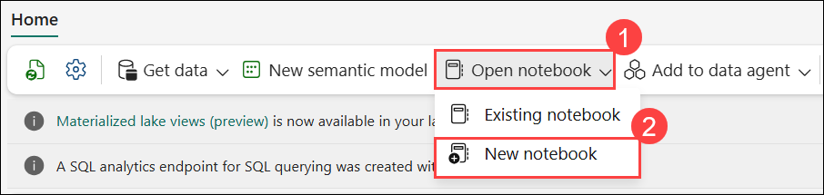

    After a few seconds, a new notebook containing a single cell will open. Notebooks are made up of one or more cells that can contain code or markdown (formatted text).

1. If the **Enhance your notebook experience with Al tools** pop-up appears, click on **Skip tour**.

    

2. Select the first cell (which is currently a code cell), and then in the top-right tool bar, use the **M↓** button to convert it to a markdown cell. The text contained      in the cell will then be displayed as formatted text. Use markdown cells to provide explanatory information about your code.

   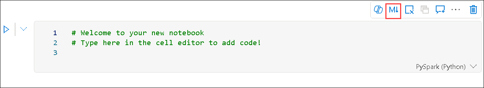

3. Use the 🖉 (Edit) button to switch the cell to editing mode, then modify the markdown as follows:

    ```markdown
    # Delta Lake tables 
    Use this notebook to explore Delta Lake functionality 
    ```

4. Click anywhere in the notebook outside of the cell to stop editing it and see the rendered markdown.

5. Add a new code cell, and add the following code **(1)** to read the products data into a DataFrame using a defined schema:

    ```python
    from pyspark.sql.types import StructType, IntegerType, StringType, DoubleType

    # define the schema
    schema = StructType() \
    .add("ProductID", IntegerType(), True) \
    .add("ProductName", StringType(), True) \
    .add("Category", StringType(), True) \
    .add("ListPrice", DoubleType(), True)

    df = spark.read.format("csv").option("header","true").schema(schema).load("Files/products/products.csv")
    # df now is a Spark DataFrame containing CSV data from "Files/products/products.csv".
    display(df)
    ```

   >**Tip**: Hide or display the explorer panes by using the chevron « icon. This enables you to either focus on the notebook, or your files.

6. Use the **Run cell** (▷) button on the left of the cell to run it **(2)**.

   >**Note**: Since this is the first time you’ve run any code in this notebook, a Spark session must be started. This means that the first run can take a minute or so to complete. Subsequent runs will be quicker.

7. When the cell code has completed, review the output below the cell, which should look similar to this **(3)**:

   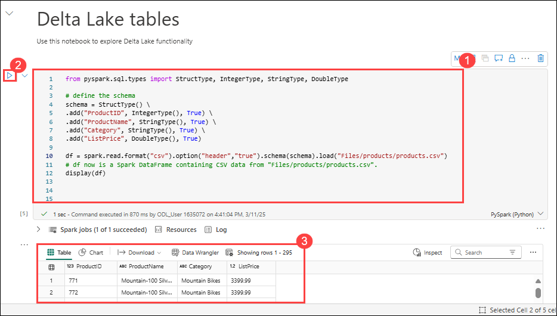
 
## Task 4: Create Delta tables

In this task, you’ll learn how to persist DataFrames as Delta tables using the saveAsTable method in Apache Spark. Delta Lake supports the creation of both managed and external tables:

   * **Managed** Delta tables benefit from higher performance, as Fabric manages both the schema metadata and the data files.

   * **External** tables allow you to store data externally, with the metadata managed by Fabric.

## Task 4.1: Create a managed table

In this task, you'll create a managed Delta table by writing the DataFrame to your lakehouse using the saveAsTable method. 

The data files are created in the **Tables** folder.

1. Under the results returned by the first code cell, use the **+ Code** icon to add a new code cell.

    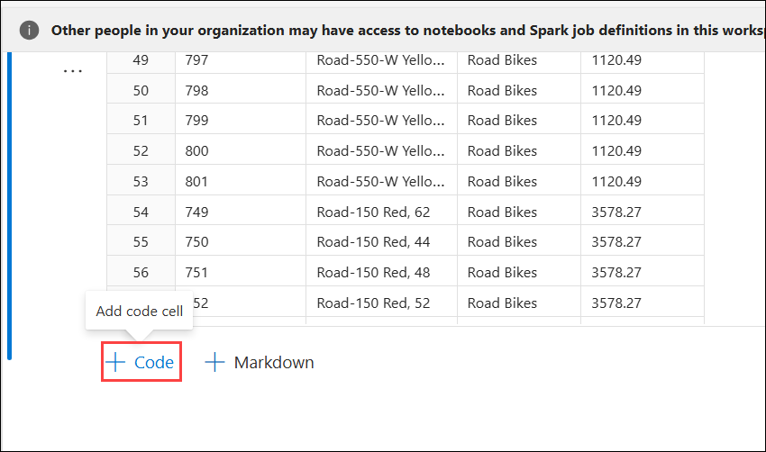

   >**Tip**: To see the + Code icon, move the mouse to just below and to the left of the output from the current cell. Alternatively, in the menu bar, on the Edit tab, select **+ Add code cell**.

2. To create a managed Delta table, add a new cell, enter the following code, and then run the cell:

    ```python
    df.write.format("delta").saveAsTable("managed_products")
    ```

3. In the Lakehouse explorer pane, **Refresh** the Tables folder and expand the Tables node to verify that the **managed_products** table has been created.

   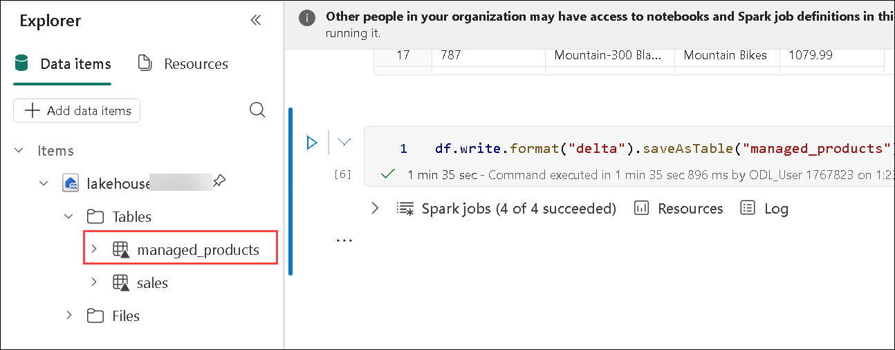

     >**Note**: The triangle icon next to the file name indicates a Delta table.

1. The files for managed tables are stored in the **Tables** folder in the lakehouse. A folder named **managed_products** has been created, which stores the Parquet files and the delta_log folder for the table.

## Task 4.2: Create an external table

In this task, you'll create an external Delta table, where the data files are stored in a specified location (such as a folder in your lakehouse), while the table schema is maintained by Microsoft Fabric.

1. In the Lakehouse explorer pane, in the **ellipsis (...) (1)** menu for the **Files** folder, select **Copy ABFS path (2)**. The ABFS path is the fully qualified path to the lakehouse Files folder.

   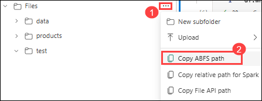

2. In a new code cell, paste the ABFS path. Add the following code **(1)**, using cut and paste to insert the abfs_path into the correct place in the code:

    ```python
    df.write.format("delta").saveAsTable("external_products", path="abfs_path/external_products")
    ```

3. The full path should look similar to this:

    ```python
    abfss://workspace@tenant-onelake.dfs.fabric.microsoft.com/lakehousename.Lakehouse/Files/external_products
    ```

4. **Run (2)** the cell to save the DataFrame as an external table in the Files/external_products folder.

5. In the Lakehouse explorer pane, **Refresh** the Tables folder and expand the Tables node and verify that the **external_products (3)** table has been created containing    the schema metadata.

   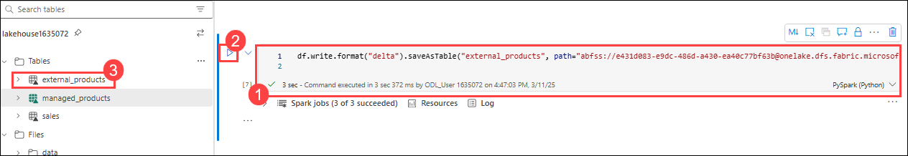

6. In the Lakehouse explorer pane, in the … menu for the Files folder, select **Refresh**. Then expand the Files node and verify that the **external_products** folder has been created for the table’s data files.

## Task 5: Compare managed and external tables

In this task, you will use the %%sql magic command to query both managed and external Delta tables and observe the differences between them. 

1. In a new code cell and run the following code:

    ```python
    %%sql
    DESCRIBE FORMATTED managed_products;
    ```

2. In the results, view the Location property for the table. Click on the **Location (1)** value in the Data type column to see the full path. Notice that the OneLake storage location ends with **/Tables/managed_products (2)**.

   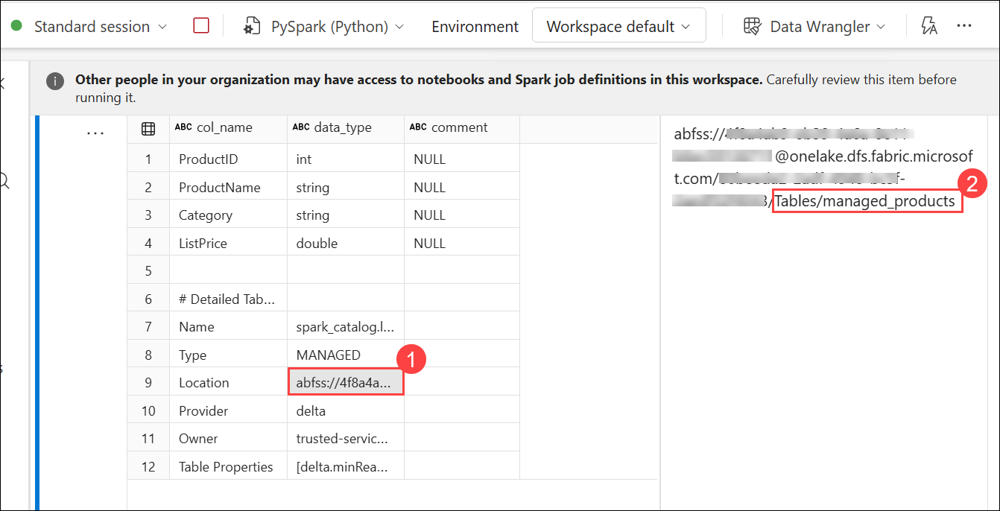

3. Modify the DESCRIBE command to show the details of the external_products table as shown here:

    ```python
    %%sql
    DESCRIBE FORMATTED external_products;
    ```

4. Run the cell and in the results, view the **Location (1)** property for the table. Widen the Data type column to see the full path and notice that the OneLake storage locations end with **/Files/external_products (2)**.

   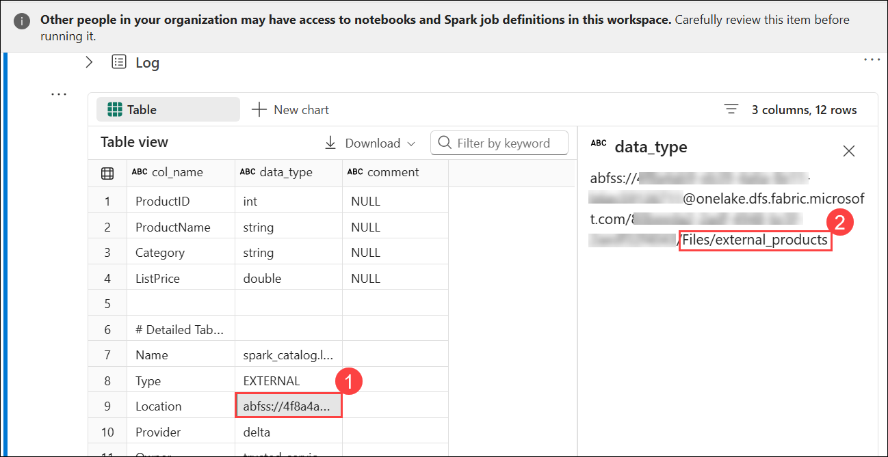

5. In a new code cell and run the following code:

    ```python
    %%sql
    DROP TABLE managed_products;
    DROP TABLE external_products;
    ```

6. In the Lakehouse explorer pane, **Refresh** the **Tables** folder to verify that no tables are listed in the Tables node.

   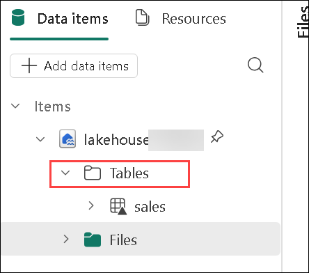

7. In the Lakehouse explorer pane, **Refresh** the **Files (1)** folder and verify that the **external_products (2)** file has *not* been deleted. Select this folder to       view the Parquet data files and the _delta_log folder. 

   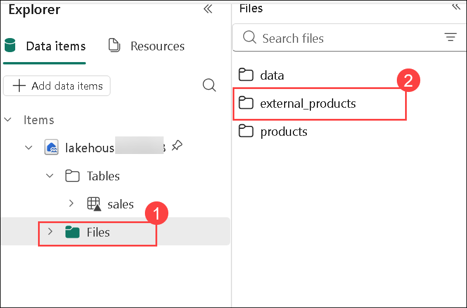

The metadata for the external table was deleted, but not the data file.

## Task 6: Use SQL to create a Delta table

In this task, you'll create a Delta table using SQL within a notebook cell by leveraging the %%sql magic command. 

1. Add another code cell and run the following code:

    ```python
    %%sql
    CREATE TABLE products
    USING DELTA
    LOCATION 'Files/external_products';
    ```

2. In the Lakehouse explorer pane, in the **ellipsis (...)** menu for the **Tables** folder, select **Refresh**. Then expand the Tables node and verify that a new table named **products** is listed. Then expand the table to view the schema.

    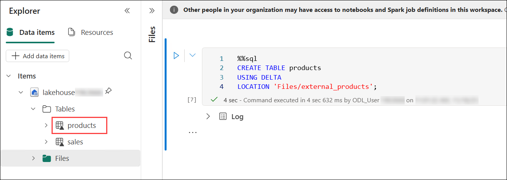

3. Add another code cell and run the following code:

    ```python
    %%sql
    SELECT * FROM products;
    ```

## Task 7: Explore table versioning

In this task, you will examine the version history of a Delta table by using the DESCRIBE HISTORY command in a notebook. 

Transaction history for Delta tables is stored in JSON files in the delta_log folder. You can use this transaction log to manage data versioning.

1. Add a new code cell to the notebook and run the following code, which implements a 10% reduction in the price for mountain bikes:

    ```python
    %%sql
    UPDATE products
    SET ListPrice = ListPrice * 0.9
    WHERE Category = 'Mountain Bikes';
    ```

2. Add another code cell and run the following code:

    ```python
    %%sql
    DESCRIBE HISTORY products;
    ```

    The results show the history of transactions recorded for the table.

3. Add another code cell and run the following code:

    ```python
    delta_table_path = 'Files/external_products'
    # Get the current data
    current_data = spark.read.format("delta").load(delta_table_path)
    display(current_data)

    # Get the version 0 data
    original_data = spark.read.format("delta").option("versionAsOf", 0).load(delta_table_path)
    display(original_data)
    ```

    Two result sets are returned - one containing the data after the price reduction, and the other showing the original version of the data.

    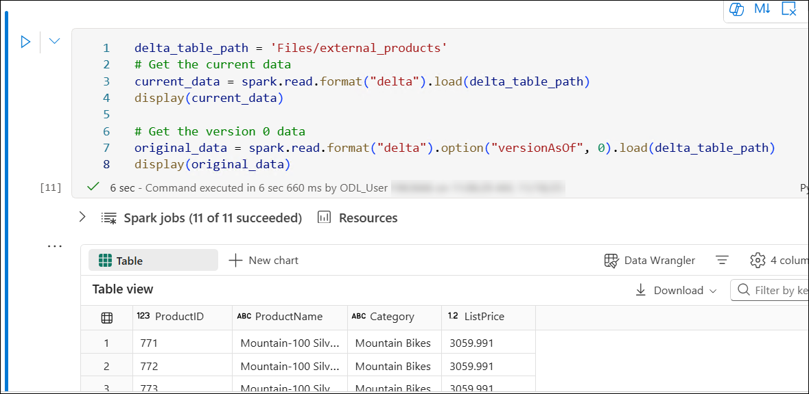

## Task 8: Analyze Delta table data with SQL queries

In this task, you will analyze the data stored in your Delta table by writing SQL queries using the %%sql magic command in your notebook. This allows you to interact with the Delta table using familiar SQL syntax, making it easy to perform data exploration and analysis. You will create a temporary view from the managed_products table and run queries to filter, aggregate, and sort data, helping you uncover meaningful insights from the dataset.

Using the SQL magic command, you can use SQL syntax instead of PySpark. Here, you will create a temporary view from the products table using a `SELECT` statement.

1. Add a new code cell, and run the following code to create and display the temporary view:

    ```python
   %%sql
   -- Create a temporary view
   CREATE OR REPLACE TEMPORARY VIEW products_view
   AS
       SELECT Category, COUNT(*) AS NumProducts, MIN(ListPrice) AS MinPrice, MAX(ListPrice) AS MaxPrice, AVG(ListPrice) AS AvgPrice
       FROM products
       GROUP BY Category;

   SELECT *
   FROM products_view
   ORDER BY Category;    
    ```

2. Add a new code cell, enter the following code to return the top 10 categories by number of products **(1)** and then click on **Run (2)**:

    ```python
   %%sql
   SELECT Category, NumProducts
   FROM products_view
   ORDER BY NumProducts DESC
   LIMIT 10;
    ```

3. When the data is returned, select the **+ New Chart (3)** view to display a bar chart.

    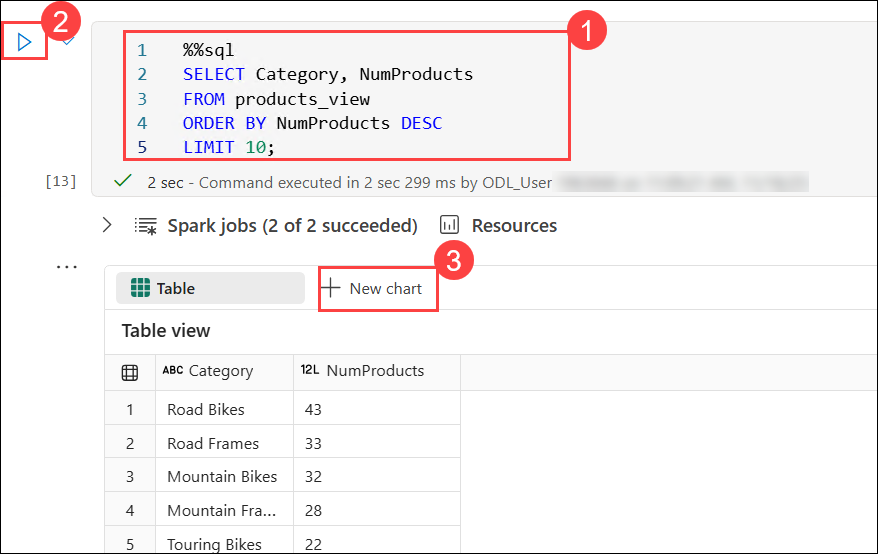

1. Click on the **Build my own (1)** from the bottom right. Under the **Chart settings** section, scroll down and select the follosing settings:

    - X-axis: **Category (2)**

    - Y-axis: **NumProducts (3)**

        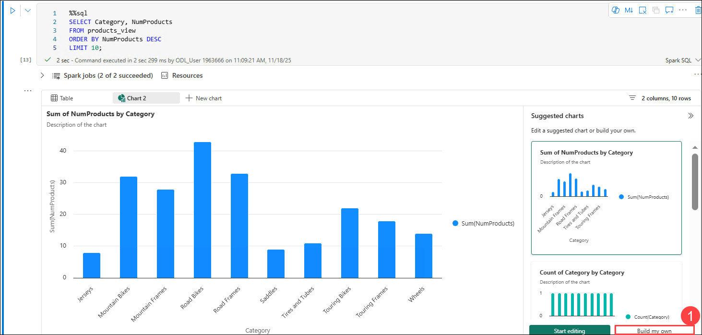

        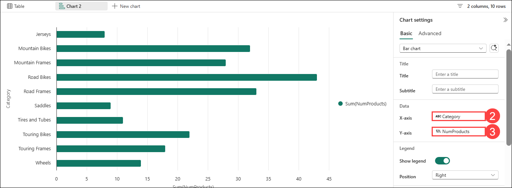

        Alternatively, you can run a SQL query using PySpark.

4. Add a new code cell, and run the following code:

    ```python
   from pyspark.sql.functions import col, desc

   df_products = spark.sql("SELECT Category, MinPrice, MaxPrice, AvgPrice FROM products_view").orderBy(col("AvgPrice").desc())
   display(df_products.limit(6))
    ```

    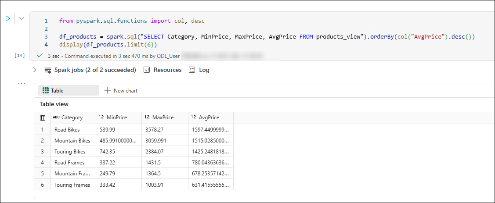

## Task 9: Use delta tables for streaming data

In this task, you will explore how to use delta tables for streaming data.

Delta Lake supports streaming data. Delta tables can be a *sink* or a *source* for data streams created using the Spark Structured Streaming API. In this example, you'll use a delta table as a sink for some streaming data in a simulated Internet of Things (IoT) scenario.

1. Add a new code cell in the notebook. Then, in the new cell, add the following code and run it:

    ```python
   from notebookutils import mssparkutils
   from pyspark.sql.types import *
   from pyspark.sql.functions import *

   # Create a folder
   inputPath = 'Files/data/'
   mssparkutils.fs.mkdirs(inputPath)

   # Create a stream that reads data from the folder, using a JSON schema
   jsonSchema = StructType([
   StructField("device", StringType(), False),
   StructField("status", StringType(), False)
   ])
   iotstream = spark.readStream.schema(jsonSchema).option("maxFilesPerTrigger", 1).json(inputPath)

   # Write some event data to the folder
   device_data = '''{"device":"Dev1","status":"ok"}
   {"device":"Dev1","status":"ok"}
   {"device":"Dev1","status":"ok"}
   {"device":"Dev2","status":"error"}
   {"device":"Dev1","status":"ok"}
   {"device":"Dev1","status":"error"}
   {"device":"Dev2","status":"ok"}
   {"device":"Dev2","status":"error"}
   {"device":"Dev1","status":"ok"}'''
   mssparkutils.fs.put(inputPath + "data.txt", device_data, True)
   print("Source stream created...")
    ```

    Ensure the message *Source stream created...* is printed. The code you just ran has created a streaming data source based on a folder to which some data has been saved, representing readings from hypothetical IoT devices.

    The output will look similar to this:

     

1. In a new code cell, add and run the following code:

    ```python
   # Write the stream to a delta table
   delta_stream_table_path = 'Tables/iotdevicedata'
   checkpointpath = 'Files/delta/checkpoint'
   deltastream = iotstream.writeStream.format("delta").option("checkpointLocation", checkpointpath).start(delta_stream_table_path)
   print("Streaming to delta sink...")
    ```

    This code writes the streaming device data in delta format to a folder named **iotdevicedata**. Because the folder is created under the **Tables** location, a table will automatically be created for it.

    The output will look similar to this:

     

1. In a new code cell, add and run the following code:

    ```sql
   %%sql

   SELECT * FROM IotDeviceData;
    ```

    This code queries the **IotDeviceData** table, which contains the device data from the streaming source.

    The output will look similar to this:

     

1. In a new code cell, add and run the following code:

    ```python
   # Add more data to the source stream
   more_data = '''{"device":"Dev1","status":"ok"}
   {"device":"Dev1","status":"ok"}
   {"device":"Dev1","status":"ok"}
   {"device":"Dev1","status":"ok"}
   {"device":"Dev1","status":"error"}
   {"device":"Dev2","status":"error"}
   {"device":"Dev1","status":"ok"}'''

   mssparkutils.fs.put(inputPath + "more-data.txt", more_data, True)
    ```

    This code writes more hypothetical device data to the streaming source.

    The output will look similar to this:

     

1. Re-run the cell containing the following code:

    ```sql
   %%sql

   SELECT * FROM IotDeviceData;
    ```

    This code queries the **IotDeviceData** table again, which should now include the additional data that was added to the streaming source.

1. In a new code cell, add and run the following code:

    ```python
   deltastream.stop()
    ```

    

    **Note:** This code stops the stream.

## Summary

In this lab, you have gained hands-on experience with using delta tables in Apache Spark within Microsoft Fabric. You created a workspace and a lakehouse, uploaded data, and explored it using Spark DataFrames. You then created both managed and external delta tables, examined their differences, and utilized SQL to interact with them. You also explored the versioning capabilities of delta tables and implemented a streaming data pipeline using delta tables as a sink for streaming data.

### You have successfully completed Lab 1. Click **Next >>** to proceed to the next lab.


