# Lab 02: Ingest data with a pipeline

### Estimated Duration: 120 Minutes

## Overview

In this lab, you will learn how to use Data Factory pipelines in Microsoft Fabric to implement data ingestion solutions. You will create a pipeline that uses a Copy Data activity to copy data from an external source into your lakehouse, and then use a Spark notebook to transform the ingested data and load it into a table. Finally, you will modify the pipeline to include the notebook as part of the workflow.

## Objectives

In this lab, you will complete the following tasks:

 - Task 1: Create a Subfolder in lakehouse
 - Task 2: Create a pipeline
 - Task 3: Create a notebook
 - Task 4: Modify the pipeline

## Architecture Diagram


## Use Data Factory pipelines in Microsoft Fabric

A data lakehouse is a common analytical data store for cloud-scale analytics solutions. One of the core tasks of a data engineer is to implement and manage the ingestion of data from multiple operational data sources into the lakehouse. In Microsoft Fabric, you can implement *extract, transform, and load* (ETL) or *extract, load, and transform* (ELT) solutions for data ingestion through the creation of *pipelines*.

Fabric also supports Apache Spark, enabling you to write and run code to process data at scale. By combining the pipeline and Spark capabilities in Fabric, you can implement complex data ingestion logic that copies data from external sources into the OneLake storage on which the lakehouse is based, and then uses Spark code to perform custom data transformations before loading it into tables for analysis.

## Task 1: Create a Subfolder in lakehouse

In this task, you will create subfolder in the existing lakehouse.

1. On the menu bar on the left, select the **Lakehouse** created earlier.

1. On the **Explorer** pane on the left, in the **... (1)** menu for the **Files** node, select **New subfolder (2)**.

   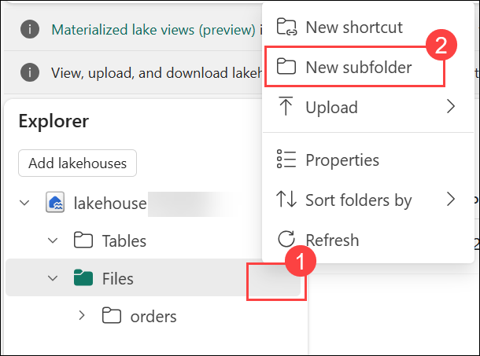

1. Create a subfolder named **new_data (1)** and then click on **Create (2)**.

   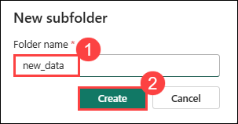

## Task 2: Create a pipeline

In this task, you will create a pipeline in Microsoft Fabric to ingest data into your lakehouse. You will use the Copy Data activity to extract data from a source and copy it into a subfolder within the lakehouse, forming the foundation for an ETL or ELT process.

1. On the **Home** page for your lakehouse, select **Get data (1)** and then select **New copy job (2)**.

    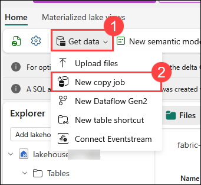

    - Create a new data copy job named **Ingest Sales Data (3)** and then **Create (4)**.

      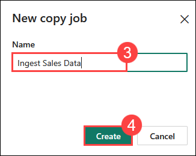

1. If the **Copy job** wizard doesn't open automatically, select **Copy Data > Use copy assistant** in the pipeline editor page.

1. In the **Copy job** wizard, on the **Choose data source** page, enter **HTTP (1)** in the search bar and then select **HTTP (2)** in the **New sources** section.

    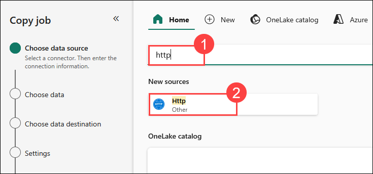

1. In the **Connect to data source** pane, enter the following settings for the connection to your data source and then click on **Next (6)**:

    - **URL**: `https://raw.githubusercontent.com/MicrosoftLearning/dp-data/main/sales.csv` **(1)**
    - **Connection**: Create new connection **(2)**
    - **Connection name**: *Specify a unique name* **(3)**
    - **Data gateway**: (none) **(4)**
    - **Authentication kind**: Anonymous **(5)**

      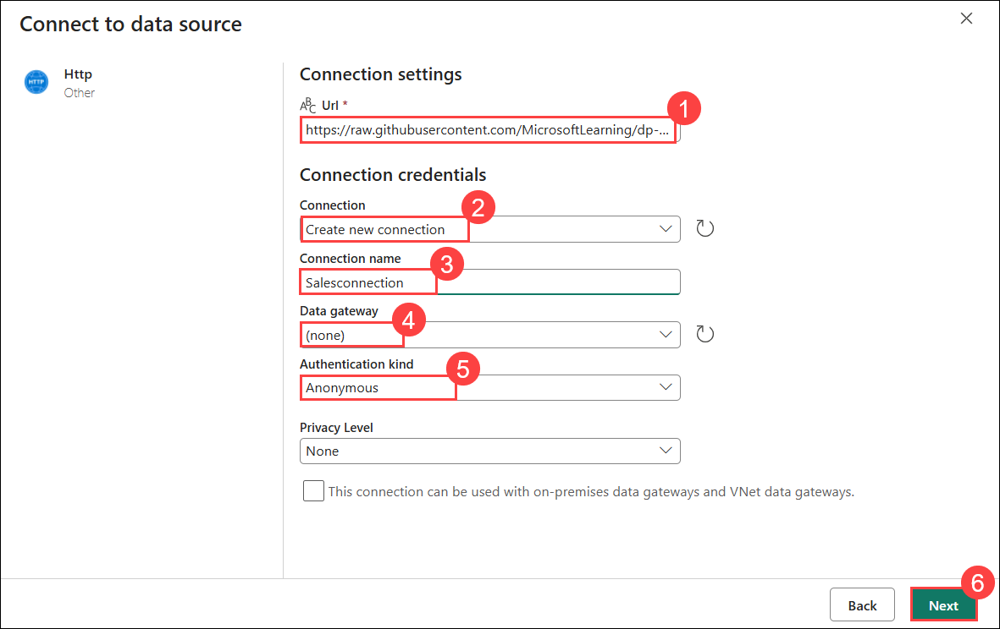

1. Then ensure the following settings are selected and then click on **Next**:

    - **Relative URL**: *Leave blank*
    - **Request method**: GET
    - **Additional headers**: *Leave blank*
    - **Binary copy**: <u>Un</u>selected
    - **Request timeout**: *Leave blank*
    - **Max concurrent connections**: *Leave blank*

      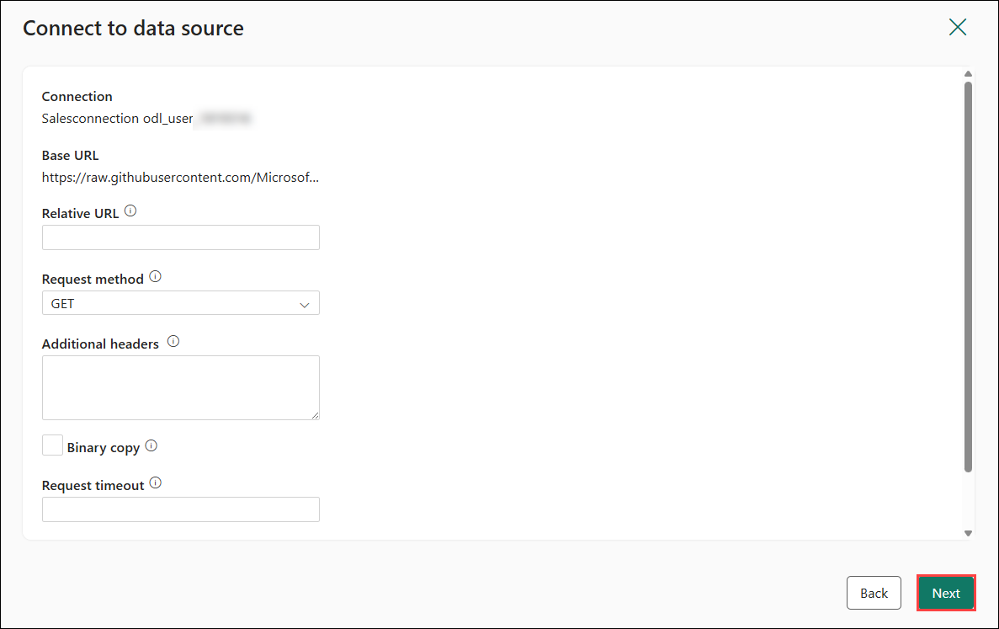

1. Wait for the data to be sampled and then ensure that the following settings are selected. Ensure following settings are select and then click on **Next (6)**:

    - **File format**: DelimitedText **(1)**
    - **Column delimiter**: Comma (,) **(2)**
    - **Row delimiter**: Line feed (\n) **(3)**
    - **First row as header**: Selected **(4)**
    - **Compression type**: No compression **(5)**

      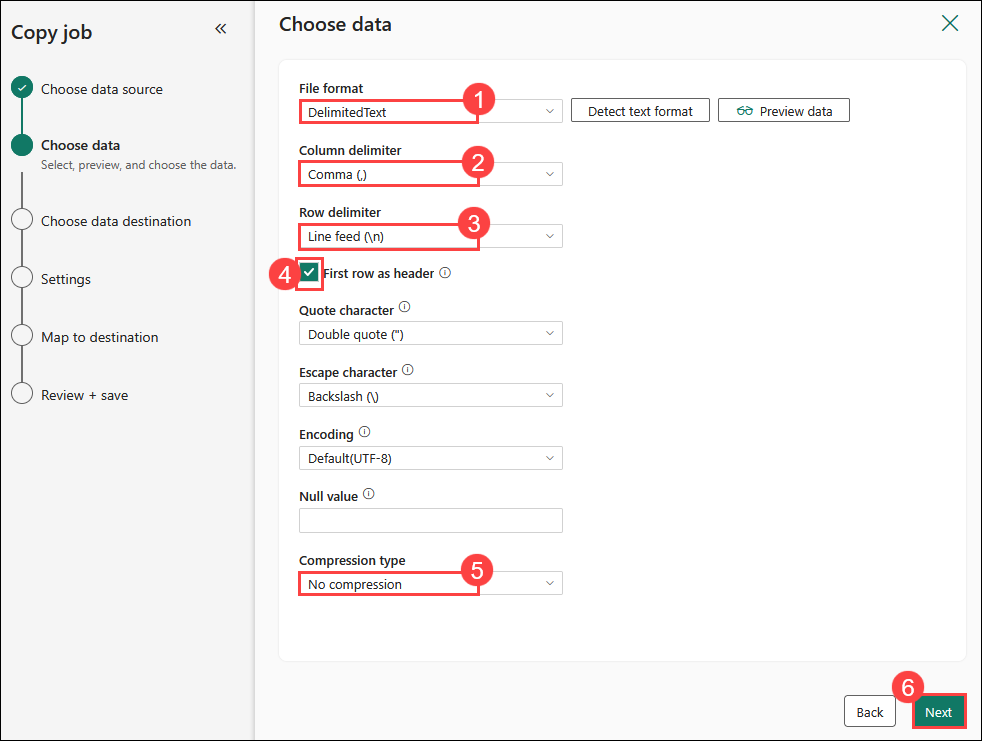    

1. Select **Preview data** to see a sample of the data that will be ingested.

    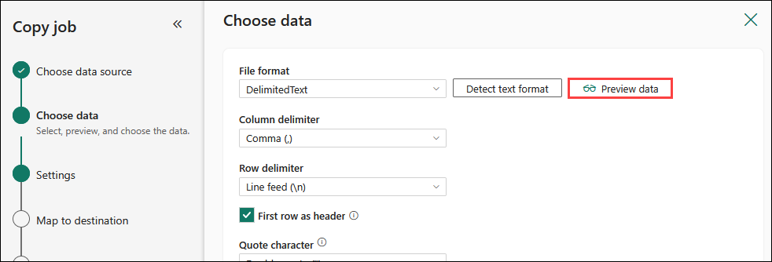

1. Then close the data preview and select **Next**.    

1. In the settings page, select **Files** are destination root folder and click on **Next**.

    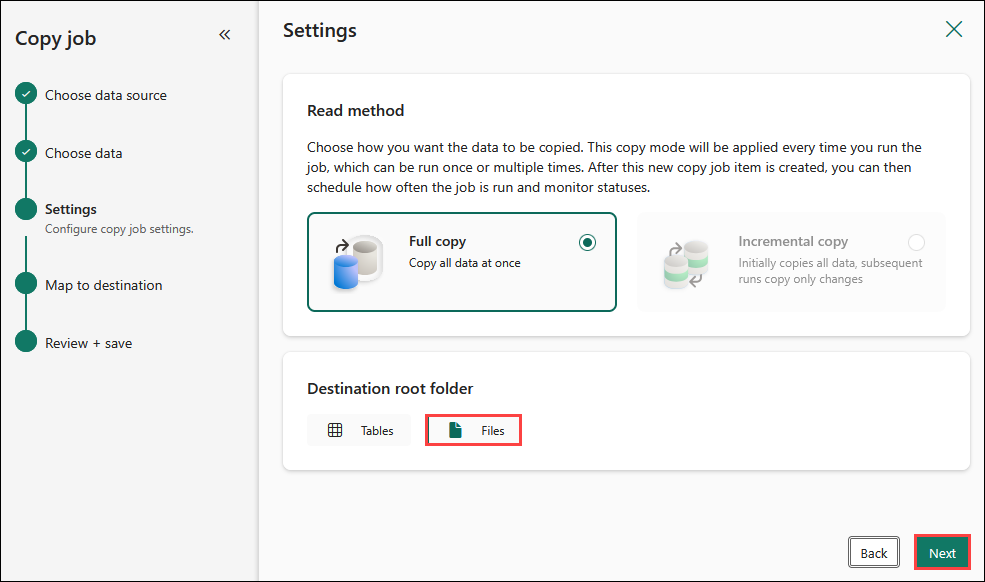

1. On the **Map to data destination** page, set the following data destination options, and then select **Next (5)**:

    - **Folder folder**: new_data/ **(1)**
    - **File name**: sales.csv **(2)**
    - **Copy behavior**: None **(3)**
    - **File format**: DelimitedText **(4)**    

      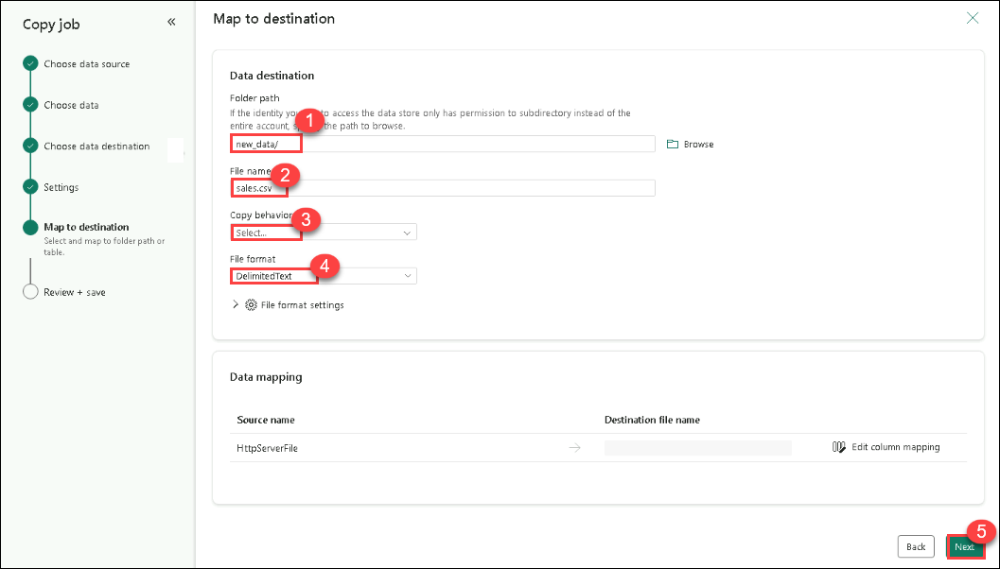     

1. On the **Review + Save** page, review the details of your copy operation and then select **Save + Run**.

    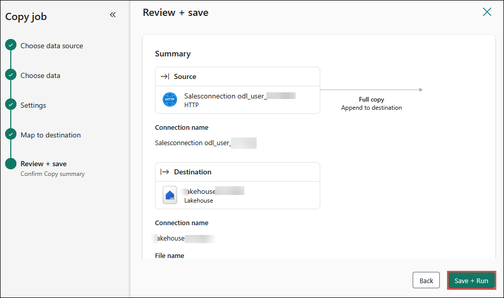

1. A new pipeline containing a **Copy job** activity is created, as shown here:

    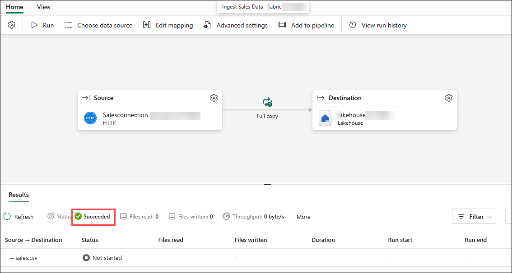

1. When the pipeline starts to run, you can monitor its status in the **Output** pane under the pipeline designer. Use the **&#8635;** (*Refresh*) icon to refresh the status, and wait until it has **succeeded**.

    

1. Select your lakehouse **fb_lakehouse** from the top menu bar.

1. On the **Home** page, in the **Lakehouse explorer** pane, expand **Files** and select the **new_data (1)** folder to verify that the **sales.csv (2)** file has been copied.

    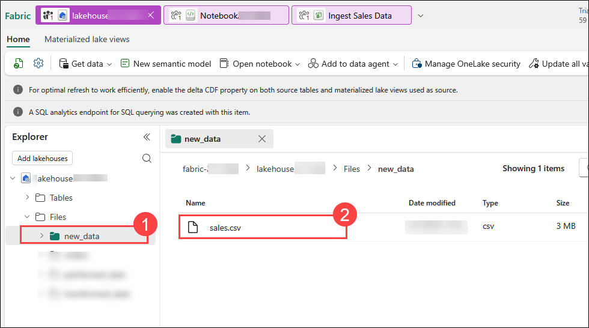

## Task 3: Create a notebook

In this task, you will create a notebook in Microsoft Fabric to begin processing your ingested data using PySpark. You’ll write code to load sales data, apply transformations, and save the results as a table in the lakehouse—enabling further analysis or reporting through SQL or visualization tools.

1. On the **Home** page for your lakehouse, in the **Open notebook (1)** menu, select **New notebook (2)**.

    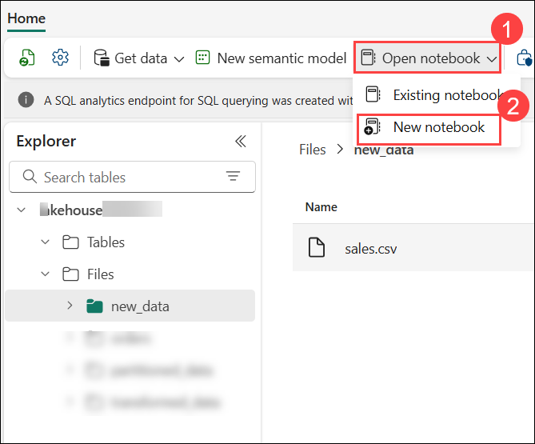

     >**Note**: After a few seconds, a new notebook containing a single *cell* will open. Notebooks are made up of one or more cells that can contain *code* or *markdown* (formatted text).

1. Select the existing cell in the notebook, which contains some simple code, and then replace the default code with the following variable declaration.

    ```python
   table_name = "sales"
    ```

1. In the **... (1)** menu for the cell (at its top-right) select **Toggle parameter cell (2)**. This configures the cell so that the variables declared in it are treated as parameters when running the notebook from a pipeline.

    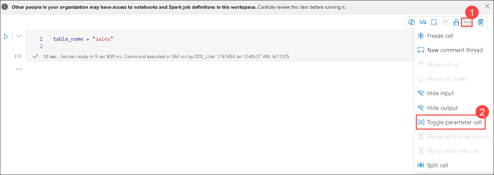

1. Run the cell.

    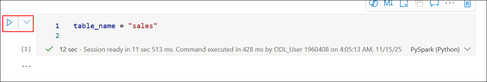

1. Under the parameters cell, use the **+ Code** button to add a new code cell. Then add the following code to it:

    ```python
   from pyspark.sql.functions import *

   # Read the new sales data
   df = spark.read.format("csv").option("header","true").load("Files/new_data/*.csv")

   ## Add month and year columns
   df = df.withColumn("Year", year(col("OrderDate"))).withColumn("Month", month(col("OrderDate")))

   # Derive FirstName and LastName columns
   df = df.withColumn("FirstName", split(col("CustomerName"), " ").getItem(0)).withColumn("LastName", split(col("CustomerName"), " ").getItem(1))

   # Filter and reorder columns
   df = df["SalesOrderNumber", "SalesOrderLineNumber", "OrderDate", "Year", "Month", "FirstName", "LastName", "EmailAddress", "Item", "Quantity", "UnitPrice", "TaxAmount"]

   # Load the data into a table
   df.write.format("delta").mode("append").saveAsTable(table_name)
    ```

    This code loads the data from the sales.csv file that was ingested by the **Copy Data** activity, applies some transformation logic, and saves the transformed data as a table - appending the data if the table already exists.

1. Verify that your notebooks looks similar to this, and then use the **&#9655; Run all** button on the toolbar to run all of the cells it contains.

    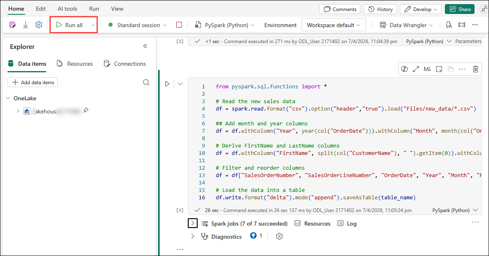

    > **Note**: Since this is the first time you've run any Spark code in this session, the Spark pool must be started. This means that the first cell can take a minute or so to complete.

1. When the notebook run has completed, in the **Lakehouse explorer** pane on the left, in the **...** menu for **Tables** select **Refresh** and verify that a **sales** table has been created.

    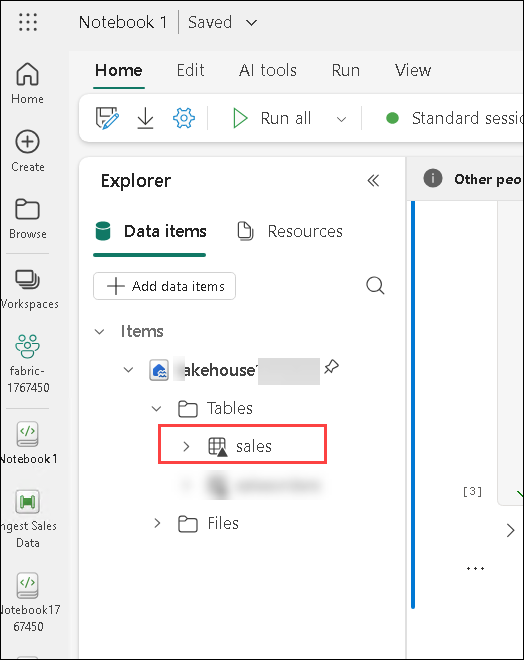

1. In the notebook menu bar, use the ⚙️ **Settings** icon to view the notebook settings.

    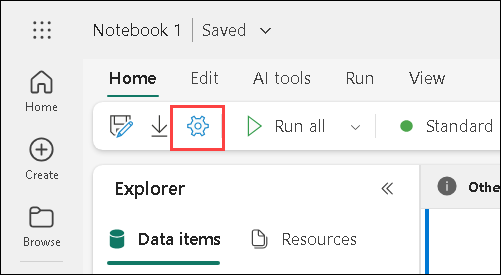

1. Then set the **Name** of the notebook to **Load Sales (1)** and close the settings pane **(2)**.

    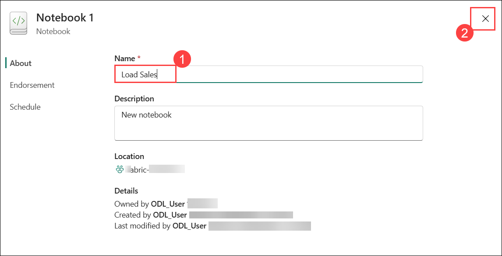

1. In the hub menu bar on the top, select your lakehouse **lakehouse<inject key="DeploymentID" enableCopy="false"/>**.

1. In the **Explorer** pane, refresh the view. Then expand **Tables (1)**, and select the **sales (2)** table to see a preview of the data it contains **(3)**.

    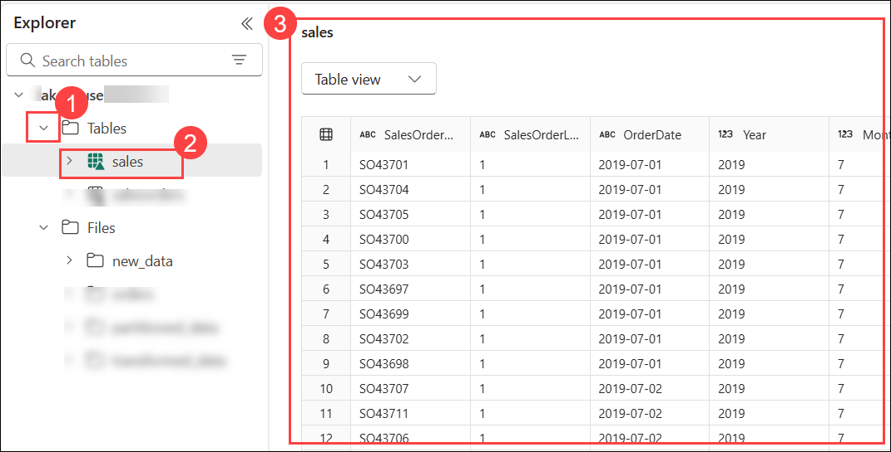

## Task 4: Modify the pipeline

In this task, you will modify your existing pipeline to include the notebook you created for data transformation. By integrating the notebook into the pipeline, you’ll build a reusable and automated ETL process that extracts data, runs Spark-based transformations, and loads the results into a lakehouse table.

1. In the hub menu bar on the left select the **Ingest Sales Data** copy job you created previously.

    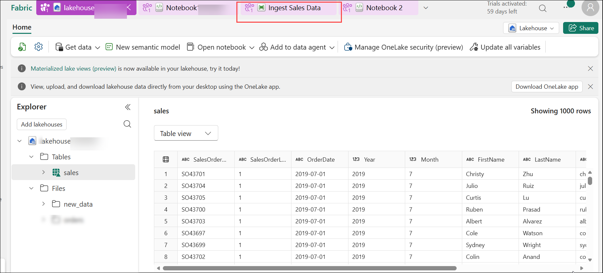

1. Click on **Add to pipeline**.

    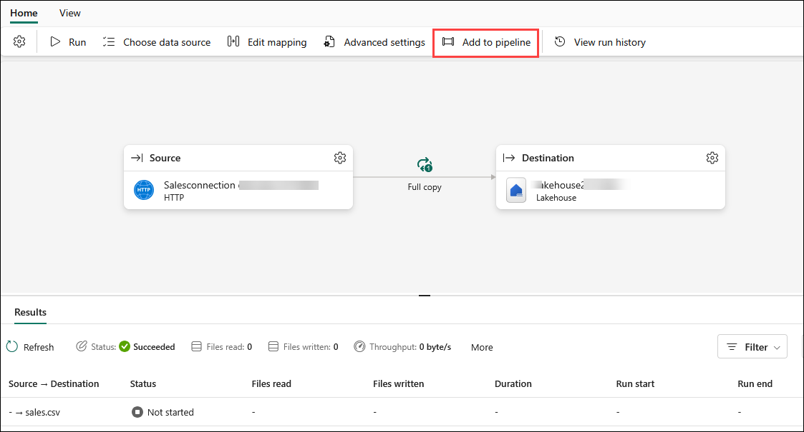

1. Provide the Name of New Pipeline as **Ingest Sales Data (1)** and click on **Create (2)**.

    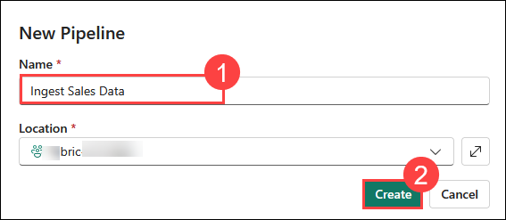

1. On the **Activities (1)** tab, click on the elipses **(...) (2)** list, select **Delete data (3)**. 

    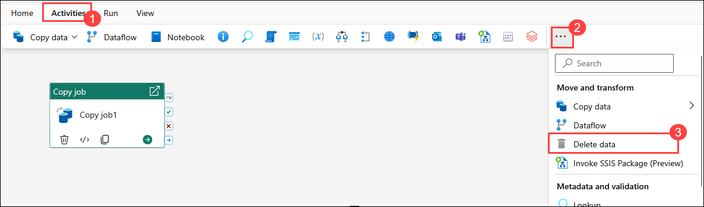

1. Then position the new **Delete data**  activity to the left of the **Copy data** activity and connect its **On completion** output to the **Copy data** activity, as shown here:    

    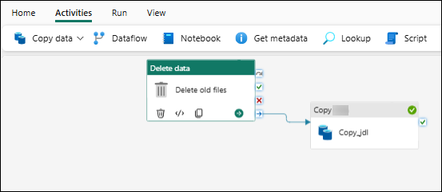

1. Select the **Delete data** activity, and in the pane below the design canvas, set the following properties:
    - **General**:
        - **Name**: Delete old files
    - **Source (1)**
        - **Connection**: **fabric_lakehouse odl_user_<inject key="DeploymentID" enableCopy="false"/> (2)**
        - **Lakehouse:** **fabric_lakehouse(3)**
        - **File path type**: Wildcard file path **(4)**
        - **Folder path**: Files / **new_data** **(5)**
        - **Wildcard file name**: *.csv **(6)**       
        - **Recursively**: *Selected* **(7)**

          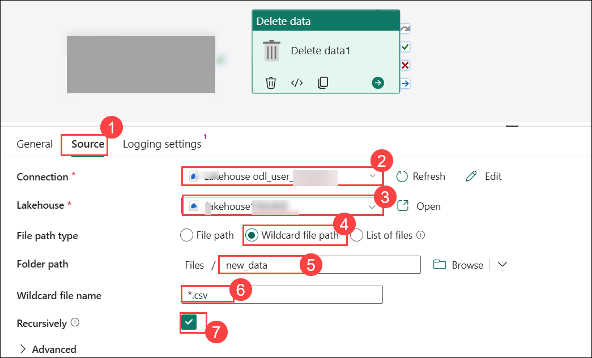

    - **Logging settings (1)**:
        - **Enable logging**: *<u>Un</u>selected* **(2)**

          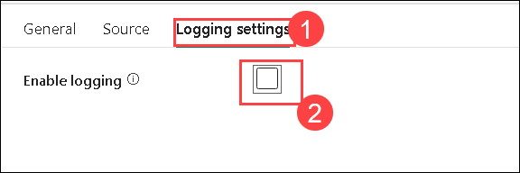        

1. These settings will ensure that any existing .csv files are deleted before copying the **sales.csv** file.

1. In the pipeline designer, on the **Activities (1)** tab, select **Notebook (2)** to add a **Notebook** activity to the pipeline.

    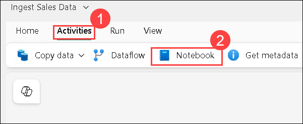

1. Select the **Copy job** activity and then connect its **On Completion** output to the **Notebook** activity as shown here:

    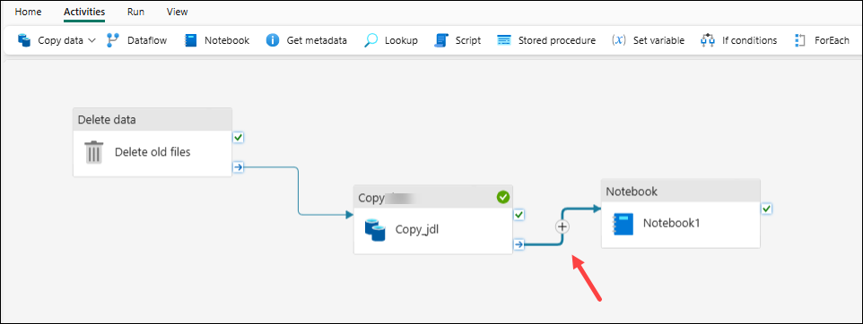

1. Select the **Notebook (1)** activity, and then in the pane below the design canvas, set the following properties:
    - **General (2)**:
        - **Name**: Load Sales notebook **(3)**

      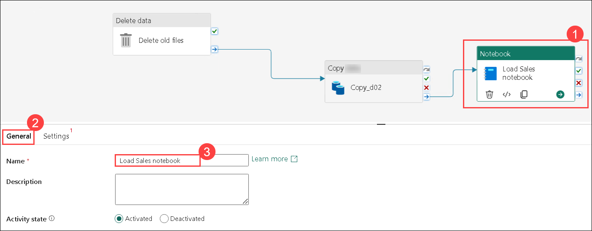

    - **Settings (1)**:
        - **Notebook**: Load Sales **(2)**
        - **Base parameters (3)**: *Add a new parameter **(4)** with the following properties:*
            
            | Name | Type | Value |
            | -- | -- | -- |
            | table_name **(5)** | String **(6)** | new_sales **(7)** |

            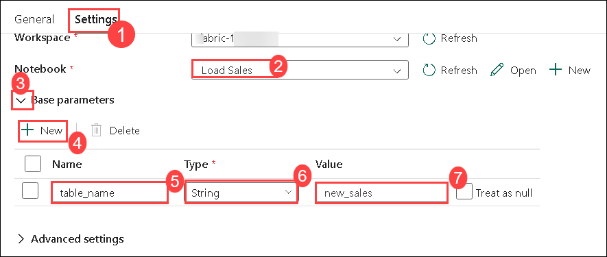            

    The **table_name** parameter will be passed to the notebook and override the default value assigned to the **table_name** variable in the parameters cell.

1. Select Copy Job activity, under **Settings (1)**, set the following properties:

    - **Connection**: Select **Browse**, choose the **copy job**, and then click **Connect** in the Connection Credentials window. The field will be automatically populated with the CopyJob odl_user_<inject key="DeploymentID" enableCopy="false"/> **(2)**
    - **Workspace**: dp_fabric-<inject key="DeploymentID" enableCopy="false"/> **(3)**
    - **Copy job**: Ingest Sales Data **(4)**

    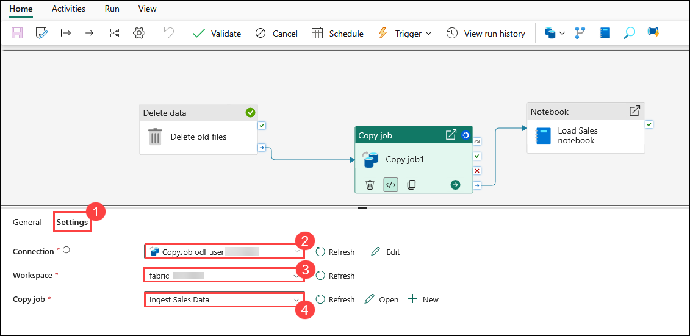

1. On the **Home** tab, use the **&#128427; (1)** (*Save*) icon to save the pipeline. Then use the **&#9655; Run (2)** button to run the pipeline.

    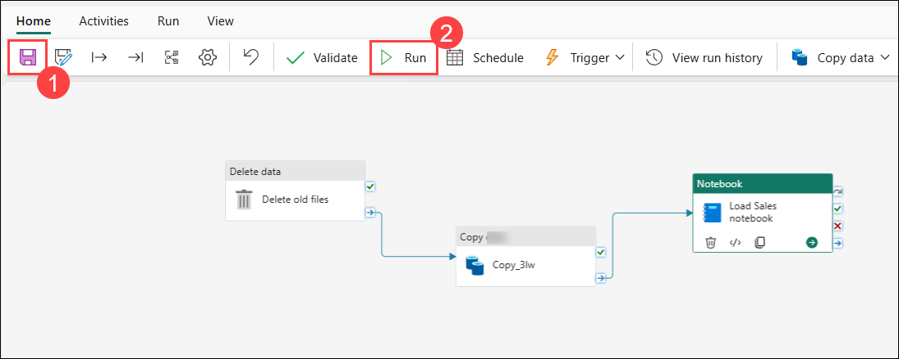

1. Click on **Save and run**.

    

1. Click on **Refresh (1)**, untill all of the activities are succeeded **(2)**.  

    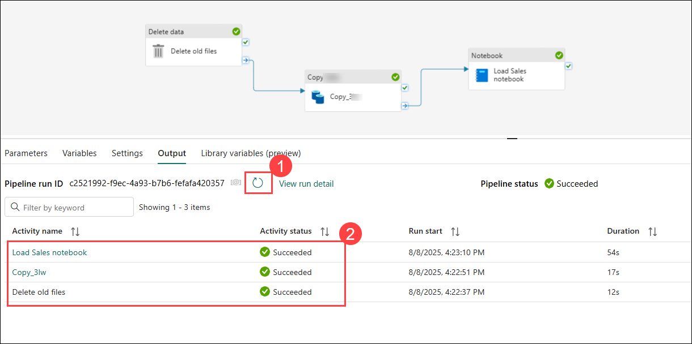

     >**Note**: In case you receive the error message *Spark SQL queries are only possible in the context of a lakehouse. Please attach a lakehouse to proceed*: Open your notebook, select the lakehouse you created on the left pane, select **Remove all Lakehouses** and then add it again. Go back to the pipeline designer and select **&#9655; Run**.

1. In the hub menu bar on the top, select your lakehouse **fabric_lakehouse**.

1. Navigate to your **Lakehouse (1)**. Then in the **Explorer** pane, expand **Tables (2)** then **refresh** and select the **new_sales (3)** table to see a preview of the data it contains. This table was created by the notebook when it was run by the pipeline.

    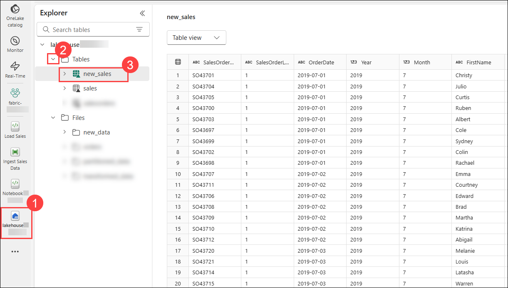

## Summary

In this lab, you have gained hands-on experience with using Data Factory pipelines in Microsoft Fabric to implement data ingestion solutions. You created a pipeline that uses a Copy Data activity to copy data from an external source into your lakehouse, and then used a Spark notebook to transform the ingested data and load it into a table. Finally, you modified the pipeline to include the notebook as part of the workflow, enabling you to automate the data transformation and loading process.

### You have successfully completed the lab.

By completing the **Work with Delta Lake and Data Factory pipelines in Microsoft Fabric** hands-on lab, you have gained practical experience in working with **Microsoft Fabric Lakehouses** and **Data Factory Pipelines** to manage and process data efficiently. You learned how to store and manage data using **Delta Lake tables**, enabling reliable, scalable, and versioned data processing through Apache Spark.

Additionally, you designed and implemented automated **ETL workflows using Fabric pipelines** to ingest, transform, and load data into your lakehouse. You also explored how to use Spark notebooks for data transformation and how to integrate them into your pipelines for end-to-end automation.

Overall, you have developed essential skills in leveraging Microsoft Fabric's capabilities for building robust data engineering solutions, enabling you to efficiently manage and analyze data in a modern data architecture.

